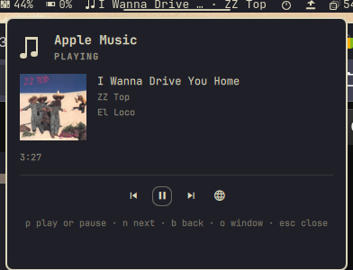

# Apple Music

Apple Music as a standalone player on Omarchy: its own window, its own MPRIS player, now playing and transport controls in the bar.



## The case it exists for

Apple Music has no native Linux client, and its API needs a developer token signed with an Apple Developer Program key that expires within months. Any plugin shipping one would stop working for everyone the day it lapsed.

The web player needs none of that. It carries its own sign-in and its own DRM, so the browser does the two hard parts and the plugin does not have to.

What the browser does not do is tell you *what* is playing. A Chromium-family browser publishes one MPRIS player per browser **process**, covering every tab, and exposes no `xesam:url`. So a widget bound to the browser's media session is really showing whatever tab is loudest: start a video in another window and your now-playing widget follows it. Omarchy's own media widget collapses every Chromium instance into a single `chromium` player for exactly this reason.

Giving Apple Music its own `--user-data-dir` gives it its own browser process, and therefore its own bus name. That is the whole trick. This widget shows Apple Music and nothing else, and the window it controls is a real app window with its own session.

## What it shows

* Track, artist and album, with the album artwork the browser writes to disk.
* Elapsed time, and a progress bar when the source reports a duration. Apple Music's web player does not: it publishes `mpris:length` as `INT64_MAX`, which is its way of saying it does not know. Rather than draw a bar that never moves and a total of `2562047788:00:54`, the panel shows the elapsed time alone.
* Whether Apple Music is closed, open but idle, playing, or paused. Those are four different states and the panel names which one it is.
* In the bar: the note icon, dimmed while nothing is running, plus the current track when there is one.

## Actions

| Key | Action |
|---|---|
| `p` | play or pause |
| `n` | next track |
| `b` | previous track |
| `o` or `enter` | open Apple Music, or focus the window if it is already open |
| `r` | re-read the player |
| `esc` | close the panel |

On the bar icon: left click opens the panel, right click plays or pauses without opening anything.

The same actions are on the shell IPC, which makes them bindable from Hyprland:

```bash
omarchy-shell ianswope.apple-music playpause
omarchy-shell ianswope.apple-music next
omarchy-shell ianswope.apple-music status     # Playing, Paused, Ready, Not running
omarchy-shell ianswope.apple-music track      # Title · Artist
```

## How it finds Apple Music

The status helper matches the pid that owns an MPRIS bus name against the process holding our profile:

```
busctl --user list      # column 2 is the owning pid
/proc/<pid>/cmdline     # the browser process for --user-data-dir=<profile>
```

Ownership rather than the name, because the `instance<pid>` naming is a Chromium convention rather than a promise, and matching by owner keeps this correct for Chrome, Brave and Chromium alike. The browser process is the one carrying `--user-data-dir` without a `--type=`, which is what separates it from the renderer, GPU and zygote children that inherit the flag.

Two things that look like they should work and do not:

* **Matching the window class.** Chrome ignores `--class` on Wayland and derives the `app_id` from the app URL instead, and the first-run dialog a fresh profile opens with has no class at all. So class matching finds nothing on the launch that most needs it. The window is found by pid.
* **Reading `/proc/<pid>/cmdline` as NUL-separated fields.** Chrome rewrites its own argv, so the arguments arrive space-joined. Both layouts are normalised before matching, and a profile path containing whitespace is refused rather than silently mismatched.

Two more that cost time and are worth knowing if you fork this:

* Chrome publishes no media session at all for clips under about five seconds, so a short test tone produces no bus name and looks exactly like a broken plugin.
* Quickshell hands `position` and `length` over already converted to seconds, not the microseconds MPRIS puts on the wire.
* `mpris:length` of `INT64_MAX` means unknown, and it is what Apple Music sends. Taken at face value it becomes 292 million years, so any length beyond a day is treated as unknown here.

## What it does not do

* No Apple developer token, no MusicKit key, no request to any Apple API. The plugin reads the media session the browser publishes and sends playback commands back through it.
* Nothing privileged. No `sudo`, no polkit, no sudoers policy, and no pid or state file in a shared temporary directory. Every read is unprivileged, and the only thing it starts is a browser.
* Your ordinary browser profile is never touched. Apple Music gets a separate profile, so its cookies and its sign-in are its own, and closing your other windows does not close it.
* No seeking yet. The panel shows the position; it does not set it.
* Nothing from the page is rendered as markup. Track metadata comes from a web page, and QML's `Text` defaults to `AutoText`, which treats anything resembling markup as rich text and fetches what it references, so a track titled `` would make the shell issue that request. Metadata is stripped of angle brackets and control characters and length-clamped as it enters the model, and every `Text` is pinned to `Text.PlainText`.

## Settings

| Setting | Default | Meaning |
|---|---|---|
| `showTrackInBar` | `true` | show the current track beside the bar icon |
| `maxBarChars` | `28` | how much of the track text the bar may use |
| `showArtwork` | `true` | show album artwork in the panel |
| `refreshIntervalSec` | `10` | how often to look for the player, on top of reacting to bus changes |

Two environment variables cover the rest:

| Variable | Meaning |
|---|---|
| `OMARCHY_APPLE_MUSIC_BROWSER` | browser binary to use instead of the detected one |
| `OMARCHY_APPLE_MUSIC_PROFILE` | where the Apple Music profile lives, default `~/.local/share/ianswope.apple-music/profile` |

## Requirements

| Dependency | Needed for |
|---|---|
| Omarchy Quattro (`omarchy-shell`) | the plugin host |
| Google Chrome or Brave | Apple Music is Widevine gated, and Arch's `chromium` ships without it |
| `jq` | the helpers |
| `hyprctl` | finding and focusing the window |
| `busctl` (systemd) | listing bus names and their owners |
| An Apple Music subscription | the web player |

The first launch opens a fresh browser profile, so it asks you to accept the browser's terms and then to sign in to Apple Music. That happens once.

## Install

```bash
omarchy plugin add https://github.com/ianswope/omarchy-apple-music.git --enable
```

## Remove

```bash
omarchy plugin remove ianswope.apple-music
```

That disables the widget, drops it from the bar layout and deletes `~/.config/omarchy/plugins/ianswope.apple-music`. The browser profile is deliberately left alone, because it holds your Apple Music sign-in. Delete it when you actually want it gone:

```bash
rm -rf ~/.local/share/ianswope.apple-music
```

## Checking what the panel sees

```bash
~/.config/omarchy/plugins/ianswope.apple-music/bin/omarchy-apple-music-status | jq
```

```json
{
  "running": true,
  "pid": 1420666,
  "bus": "org.mpris.MediaPlayer2.chromium.instance1420666",
  "profile": "/home/ian/.local/share/ianswope.apple-music/profile"
}
```

`running` without a `bus` means the window is open but has not played anything yet, which is also the state a freshly signed-in profile sits in.

## Verifying without an Apple account

`test/media-session-fixture.html` plays a quiet looping tone and publishes a media session with known metadata, so the whole path can be checked without an Apple Music subscription. It needs no network and no sign-in.

```bash
google-chrome-stable \
  --user-data-dir="$HOME/.local/share/ianswope.apple-music/profile" \
  --autoplay-policy=no-user-gesture-required \
  --app="file://$HOME/.config/omarchy/plugins/ianswope.apple-music/test/media-session-fixture.html"
```

The bar and panel should show `Fixture Track One`, `Test Artist`, `Verification Album`, artwork, and a position counting up to `0:20`. Running the same fixture under a second `--user-data-dir` at the same time is the useful test: two Chromium media sessions sit on the bus together, and this widget keeps reporting only the one in its own profile.

## License

MIT. See [LICENSE](LICENSE).
